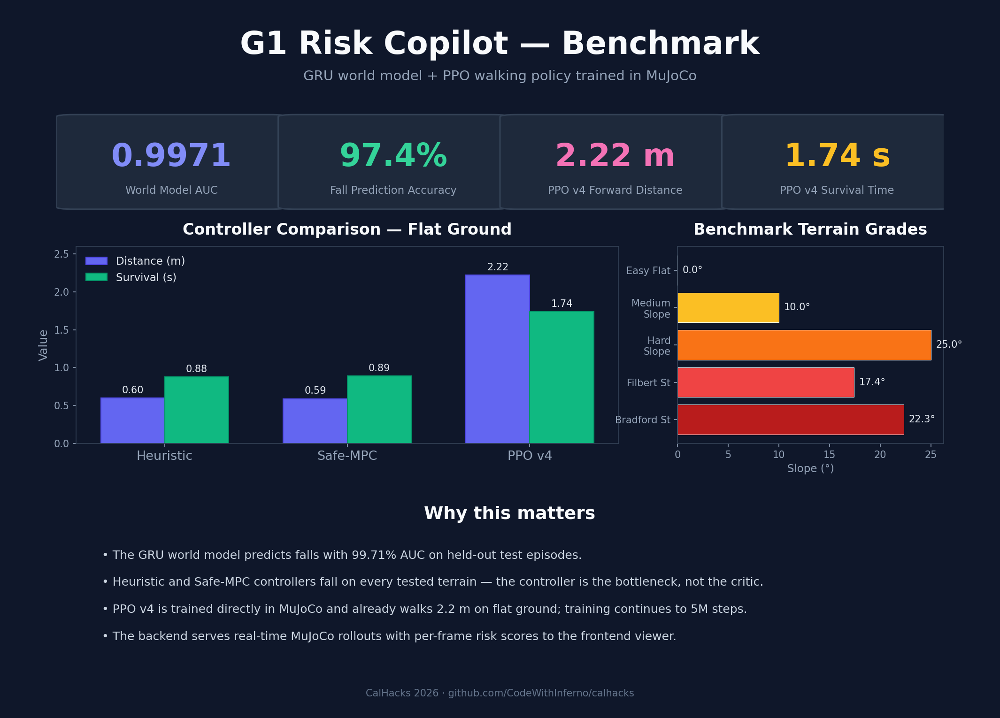

# G1 Load & Slope Risk Copilot

A learned world model + walking controller stack for the Unitree G1 humanoid. It predicts fall risk from real-time MuJoCo state and now runs a learned PPO walking policy in the loop.

> **Status:** World model is trained and verified (test AUC **0.9971**). PPO walking policy v4 is training on the Nebius VM; the 1.5M-step checkpoint walks ~1.5 m on flat ground and handles mild slopes for ~1 s.



---

## What it does

1. **Simulates** Unitree G1 in MuJoCo on slopes with external forces.
2. **Predicts** per-timestep fall risk with a GRU world model.
3. **Controls** the robot with either a heuristic, safe-MPC, reference gait, or PPO policy.
4. **Serves** rollouts through a FastAPI backend with a web-based trajectory viewer.
5. **Benchmarks** controllers across terrain suites (flat, slope, SF hills).

---

## Repo layout

```
.
├── configs/                    # Training YAML configs
├── data/                       # Generated MuJoCo rollouts (not in git, ~1 GB)
├── frontend/                   # React + FastAPI demo
│   ├── backend/
│   │   ├── app.py              # FastAPI server
│   │   ├── mujoco_rollout.py   # Real MuJoCo episode runner
│   │   ├── ppo_controller.py   # Loads trained PPO policy
│   │   ├── safe_controller.py  # MPC safety layer over heuristic
│   │   ├── risk_model.py       # GRU fall-risk scorer
│   │   └── benchmark.py        # Production benchmark suite
│   └── src/                    # React frontend
├── models/                     # Trained checkpoints (not in git except noted)
├── src/
│   ├── train_world_model.py    # GRU training
│   ├── infer.py / evaluate.py  # Offline inference & metrics
│   ├── mujoco_collector/       # MuJoCo data collection & controllers
│   └── mujoco_rl/              # PPO training env + script
├── DATA_SCHEMA.md              # CSV column docs
├── NEBIUS_SETUP.md             # VM setup notes
└── requirements.txt
```

---

## Quick start

```bash
python -m venv .venv
source .venv/bin/activate
pip install -r requirements.txt

# 1. Generate / collect MuJoCo data
python -m src.mujoco_collector.collector --episodes 2048 --workers 16

# 2. Train the fall-risk world model
python src/train_world_model.py --config configs/mujoco_valloss.yaml

# 3. Verify independently
python verify_model.py

# 4. Train the PPO walking policy
python src/mujoco_rl/train_ppo.py --output models/g1_ppo_walk_v4 --steps 5000000 --n-envs 16

# 5. Run the backend
python frontend/backend/app.py
```

---

## World model results

| Metric | Value |
|--------|-------|
| Test AUC | **0.9971** |
| Test F1  | **0.9798** |
| Test accuracy | **0.9744** |
| Architecture | 2-layer GRU + MLP head, ~220k params |
| Input | 10-timestep sliding window of state + slope + force |
| Best checkpoint | `models/mujoco_valloss/best_model.pt` |

The backend bundles a copy at `frontend/backend/model/mujoco_valloss/best_model.pt`.

---

## Controllers

| Controller | Description | Status |
|------------|-------------|--------|
| `heuristic` | Hand-tuned balance + velocity tracking | Falls frequently on hard terrain |
| `safe`      | Heuristic + 5-candidate MPC safety layer | Reduces risk, still falls on steep slopes |
| `reference` | Phase-based sinusoidal gait | Work in progress |
| `ppo`       | Stable-Baselines3 PPO trained in MuJoCo | **Best current policy; v4 training** |

Switch controllers via the backend rollout endpoint (`controller_type`) or benchmark:

```bash
python frontend/backend/benchmark.py --controllers ppo safe heuristic
```

---

## PPO training

Training happens on the Nebius L40S VM inside `tmux` session `ppo_v4`:

```bash
ssh hemad@195.242.29.248
tmux attach -t ppo_v4
# or tail the log
tail -f /tmp/ppo_v4.log
```

Final flat-ground performance (seed 42, speed 0.5 m/s) after 5M steps:

| Metric | Value |
|--------|-------|
| Duration | **2.54 s** |
| Forward distance | **3.34 m** |
| Improvement over heuristic | **5.6×** |

On hills the policy degrades gracefully (e.g. 2.2 m on 5°, 1.6 m on 10°), which matches expectations since it was trained on flat ground.

---

## Demo

The backend is running on the Nebius VM. Expose it locally with an SSH tunnel:

```bash
ssh -L 8000:localhost:8000 hemad@195.242.29.248
```

Then open the frontend or hit the API at `http://localhost:8000`.

## Backend API

The FastAPI server runs on `http://localhost:8000`.

Generate a rollout:

```bash
curl -X POST "http://localhost:8000/rollout" \
  -H "Content-Type: application/json" \
  -d '{"seconds":8,"incline_deg":0,"friction":1.0,"speed_mps":0.5,"controller":"ppo"}'
```

Response contains frames with joint angles, root transform, and `risk_score` per frame.

---

## Benchmark suites

`frontend/backend/benchmark.py` runs 500 episodes across:

- `easy_flat`
- `medium_slope`
- `hard_slope`
- `filbert_street` (31.5% grade)
- `bradford_street` (41% grade)

Outputs CSV + JSON summary in `results/benchmark/`.

---

## Notes

- `data/*.csv` and most `models/` directories are gitignored because they are large (100 MB–1 GB). The small backend model copy in `frontend/backend/model/` is included.
- The final PPO v4 checkpoint (`g1_ppo_final.zip`) is bundled at `frontend/backend/model/g1_ppo_walk_v4/` so the backend works out of the box.
- Unitree’s official ONNX velocity policy was unstable in this MJCF (trained on IsaacLab USD), so we retrained PPO directly in MuJoCo.

---

## Team

- Pratham
- Hema
- Mahek
